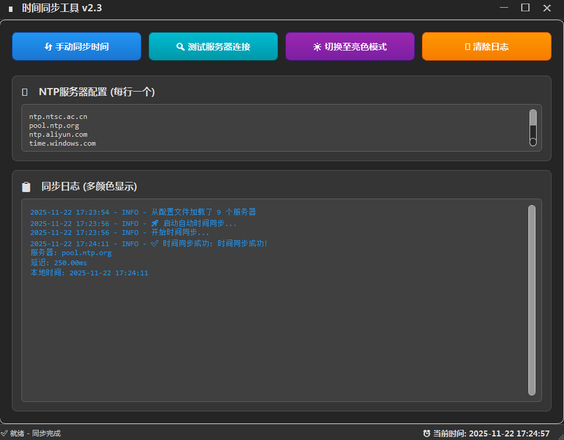

# 时间同步工具 (Time Sync Tool)


一个基于 Python 和 PyQt5 开发的 Windows 时间同步工具，通过 NTP 服务器自动校准系统时间，支持多服务器配置、主题切换和详细日志记录，确保系统时间准确可靠。

## ✨ 功能特点

- **智能时间同步**
  - 程序启动自动同步，支持用户手动触发同步
  - 自动选择可用 NTP 服务器，保障同步成功率
  - 精确计算服务器延迟，优先选择响应最快节点

- **多服务器管理**
  - 自定义 NTP 服务器列表，每行一个地址
  - 内置服务器连接测试，实时显示延迟和可用性
  - 自动保存配置，下次启动无需重新设置

- **个性化界面**
  - 亮色/暗黑主题一键切换，适应不同使用环境
  - 高 DPI 支持，兼容各种屏幕分辨率
  - 响应式布局，窗口大小调整自适应

- **详细日志系统**
  - 多级别日志记录（错误/警告/信息/调试）
  - 日志颜色编码（错误：红色，警告：橙色，信息：蓝色）
  - 支持日志清除和实时查看

- **系统兼容性**
  - 自动检测并请求管理员权限，确保时间修改成功
  - 兼容 Windows 7/8/10/11 32/64 位系统
  - 内置 UAC 权限处理，无需手动右键"以管理员身份运行"

## 📸 界面预览

| 主界面（亮色主题） | 主界面（暗黑主题） |
|------------------|------------------|
|  |  |

| 服务器测试结果 | 同步成功提示 |
|--------------|------------|
|  |  |

## 🚀 安装说明

### 直接运行（推荐）

1. 从 [Releases](https://github.com/zrf-code/time_sync/releases) 页面下载最新版本的可执行文件（`TimeSyncTool.exe`）
2. 双击运行程序（首次运行会请求管理员权限，这是修改系统时间所必需的）
3. 程序会自动在当前目录创建 `settings.ini` 配置文件和 `timesync.log` 日志文件

### 从源码运行

1. 克隆仓库：
```bash
git clone https://github.com/zrf-code/time_sync.git
cd time_sync
```

2. 安装依赖：
```bash
pip install -r requirements.txt
```

3. 运行程序：
```bash
python main.py
```

### 自行打包

如果需要自行打包成可执行文件：

```bash
# 运行打包脚本
package.bat
# 生成的可执行文件位于dist目录下
```
